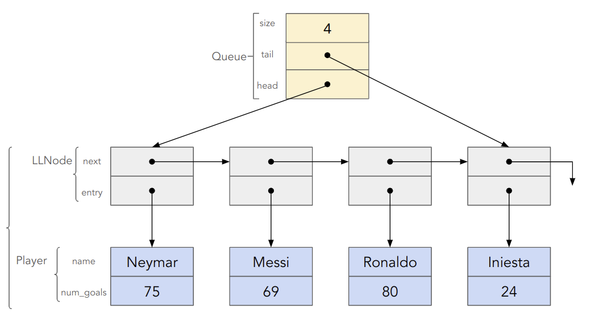

# HW03: C-style Singly Linked List Queue

## Problem 1: Implement a C-style singly linked-list based queue.
A local [futsal](https://en.wikipedia.org/wiki/Futsal) team is looking for new members and has asked you to help automate their recruitment. To fairly process the applicants, the team wants to use a [queue](https://en.wikipedia.org/wiki/Queue_(abstract_data_type)) to consider each application in the order it was recieved (First In First Out; FIFO).


Problem 1 tasks you with building the queue and its supporting functions. Use a linked list to store the queue as outlined in the following image. <u>For a review of singly linked lists, or for starting early, you can read about the data structure [here](https://en.wikipedia.org/wiki/Linked_list).</u>

If the above image does not load, open it in some external program or use [this link](https://docs.google.com/presentation/d/1Jnaa3qDPzp1Fs-4Ryc0ixqSHZzASHyDJmf62OWdhtGg/edit?usp=sharing) to see it in Google Slides.

**NOTE: Problem 2 uses Problem 1, so it is recommended that you finish Problem 1 before starting Problem 2**

### Struct Organization
You should have a header file `include/player.h` that declares the following struct that will be used as the entry in your singly-linked list:
```c++
struct Player {
    std::string name;
    int num_goals;
};
```
You should also have `include/llqueue.h` which declares these two structs:
```c++
struct LLNode {
    LLNode* next;
    Player* entry;
};

struct Queue {
    std::size_t size;
    LLNode* head;
    LLNode* tail;
};
```
The interactions between these three structs are shown both in the types and in the linked diagram.
### File Organization for Problem 1

In `src/player.cpp`, you must implement the following:

- [ ] `Player *newPlayer(std::string name, int num_goals)`: creates a new `Player` record <u>*on the heap (aka free store)*</u>
- [ ] `Player *copyPlayer(const Player *p)`: creates a copy of the provided `Player` record <u>*on the heap (aka free store)*</u>
- [ ] `void printPlayer(const Player *p)`: prints the contents of a single player struct, e.g.,
```
Player name: Neymar
Total goals: 75
```
If no player is found print the following:
```
No player found!
```
- [ ] `void deletePlayer(Player *p)`: cleans up the player record (deallocates memory associated with a player).

In `src/llqueue.cpp`, you must implement:
- [ ] `LLNode *newLLNode(Player *p)`: creates a new `LLNode` record <u>*on the heap (aka free store)*</u>
- [ ] `void deleteLLNode(LLNode *lln)`: deletes an `LLNode` and the associated `Player` record by calling `deletePlayer`. Note: the `LLNode *next` contains the address of the next node.  This address should be saved otherwise the next node (and every other node in the linked list from that point on) will become unreachable (i.e., leaked). Keep in mind the signature behavior of a queue, namely FIFO.
- [ ] `Queue *newQueue()`: creates a new `Queue` <u>*on the heap (aka free store)*</u>
- [ ] `void queuePushPlayerEntry(Queue *q, Player *entry)`: puts/enqueues the `LLNode` and its associated `Player` entry to the end of queue `q`
- [ ] `void queuePopPlayerEntry(Queue *q)`: removes/dequeues the `LLNode` and its associated `Player`entry from the front of the queue `q`. It also deallocates the memory associated with the `LLNode`and corresponding `Player` entry. If the function is called on an empty queue, do nothing.
- [ ] `Player *queueFront(Queue *q)`: returns a pointer to the player at the front of the queue `q` *without* removing the player from the front of the queue
- [ ] `Player *queueBack(Queue *q)`: returns a pointer to the player at the back of the queue `q` *without* removing the player from the back of the queue
- [ ] `std::size_t queueSize(const Queue *q)`: return the size of the queue `q`
- [ ] `void printQueue(const Queue *q)`: prints to `std::cout` the contents of the queue `q`
```
Player name: A
Total goals: 5
Player name: B
Total goals: 10
Player name: C
Total goals: 3
Player name: D
Total goals: 4
Player name: E
Total goals: 2
Player name: F
Total goals: 7
Player name: G
Total goals: 1
```
- [ ] `void deleteQueue(Queue *q)`: cleans up the entire queue and *all* players still in the queue `q`

**Note**: Any function which takes a pointer may be tested with that argument set to `nullptr`.
It is recommended to think about what should happen when this occurs, especially if there is a possible *non-crashing* recovery option.

### Memory Management

*Any* memory leak in a test will result in that test completely failing (i.e. a score of 0).
Therefore, we strongly recommend running the public tests with `cmake`.

```bash
cmake -B build
cmake --build build
./build/bin/all-tests
```

The tool we are using for leak checking is AddressSanitizer (ASan).
To build your own code with it, add `-fsanitize=address` to all of the `g++` commands that you run.
We recommend adding `-g` as well, because ASan can use debug information to give more information about the memory leaks it detects.

For example, to compile `llqueue.cpp` with ASan:
```bash
g++ -g -fsanitize=address -c src/llqueue.cpp -o llqueue.o -I include/ 
```

## Problem Statement 2: Using the singly linked-list based queue. 
Futsal is an indoor sport like soccer that is played in teams of 5.
A futsal team is looking to recruit members using your queue implementation from Problem 1.

Client code, (e.g, `src/hw03_main.cpp`) will insert many applicants' information into an applicant queue and pull a batch of $k$ potential players from the queue in first-in-first-out (FIFO) order. 

All player names that are inserted into the queue will be *unique*. The test cases will not insert players with the same name.

From this batch of $k$ players, the team will choose the player with the most goals to add to a welcome or hired/on-boarding queue.

The remaining $k-1$ players should be returned/enqueued to the original queue of applicants again in the order they were received. 

> You may want to use an intermediary queue to store the $k-1$ applicants who were not selected in the batch in the order they were received.

### Implementation Overview
The team is asking you to implement the `Player *teamBestOfBatch(Queue *q, int k)` function to accomplish this.

Here's an example (note that the letters are `std::string` names of players):
```c++
queuePushPlayerEntry(q, newPlayer("A", 5));
queuePushPlayerEntry(q, newPlayer("B", 10));
queuePushPlayerEntry(q, newPlayer("C", 3));
queuePushPlayerEntry(q, newPlayer("D", 4));
queuePushPlayerEntry(q, newPlayer("E", 2));
queuePushPlayerEntry(q, newPlayer("F", 7));
queuePushPlayerEntry(q, newPlayer("G", 1));
```

Which will insert into the queue:
```
A -> B -> C -> D -> E -> F -> G
^ head                        ^tail
```

`teamBestOfBatch(q, 3)` will pull players `A`, `B`, and `C` from the queue. 
Since `B` has the largest `num_goals` of the batch, the `teamBestOfBatch()` function will select player `B` and return its pointer.
The remaining players `A` and `C` will be returned to the back of the queue.
If there are ties in the num_goals between two or more applicants, choose the first one of the tied applicants.
```
D -> E -> F -> G -> A -> C
^head                    ^tail
```

The futsal team manager also needs to host a welcome meeting for each team player that was selected to join the team using your `teamBestOfBatch()` function. They want to individually meet with each player in the order they were selected. 

Create a `void teamCreateFromBest(Queue *applicant_q, Queue *welcome_q, int batch_size)` that will utilize the `teamBestOfBatch()` function to select 5 members (Futsal teams have 5 players) from the applicant queue, `q`, and push them in the order they were selected to `welcome_q`.$

The helper function `Player *findBestInBatch(Queue *q, Queue *tmp_q, int batch_size)` seperates the best player (return value) from the rest of the batch in `q` and copies the non-selected players to the temporary queue `tmp_q`.
It is the first step in the `teamBestOfBatch` function/algorithm.
Note that this is not considered good API design (single responsibility), but when we get to object-oriented programming, we can hide the helper function.

Here is an example of a full run to create the team of 5 using a `batch_size` of 3. Note this is provided to assist with understanding, you are not responsible for printing this to standard output.

```
Step 0
welcome_q: <empty>
applicant_q: A -> B -> C -> D -> E -> F -> G
             ^head                         ^tail

Step 1 (B has the greatest num_goals of A,B,C)
welcome_q: B
applicant_q: D -> E -> F -> G -> A -> C
             ^head                    ^tail

Step 2
welcome_q: B, F
applicant_q: G -> A -> C -> D -> E
             ^head               ^tail    

Step 3
welcome_q: B, F, A
applicant_q: D -> E -> G -> C
             ^head          ^tail 

Step 4
welcome_q: B, F, A, D
applicant_q: C -> E -> G
             ^head     ^tail 

Step 5
welcome_q: B, F, A, D, C 
applicant_q: E -> G
             ^head^tail 
```

The process is now finished because welcome_q is now at size 5.

Note: 
    - the initial number of applicants will always be greater than or equal to 5.
    - the `batch_size` is less than or equal to the number of initial applicants. 
    - the capacity of the futsal team, in `welcome_q` should be exactly 5.

## Makefile
As part of this homework, write and submit `Makefile` that uses AddressSanitizer to build a "leak checking" version of both problems.

It should have at least:
- a `CXX` variable that defines what compiler *all rules* use
- a `CXXFLAGS` variable that defines what flags *all rules* to compile with
  - Must contain at a minimum the following flags:
      1. the ASan flag 
      2. set the C++ standard to 20
      3. `-I include`
- an `all` rule as its first rule
- separate rules for building each file in src
- a `clean` rule as its last rule

## Submission

The following files need to be present and completed in the GitHub repository before submission:
- `include/futsal.h`
- `include/llqueue.h`
- `include/player.h`
- `Makefile`
- `src/futsal.cpp`
- `src/llqueue.cpp`
- `src/player.cpp`

Any intermediate files generated by running the *make* command (e.g., *.o files and executables)should be stored in the `lib` directory.
